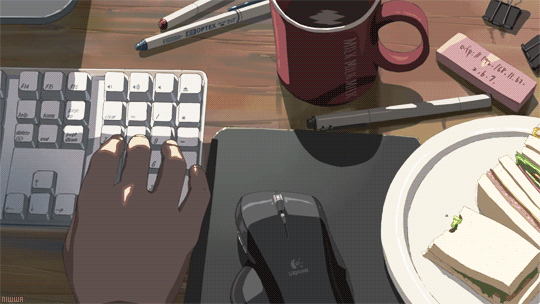

---

\> 💻 *i write code and sometimes it **even works***

\> 😭 *my git commit messages go from* `fix` → `fix2` → `why` → `please` → `ok this time for real`

\> 🪦 *i once spent 3 hours on a bug that was a **missing semicolon**. i am not the same person i was before that day*

\> ☕ *coffee is my pair programmer and it never pushes bad code (just bad decisions)*

---

<i>currently: touching grass (allegedly)</i>

